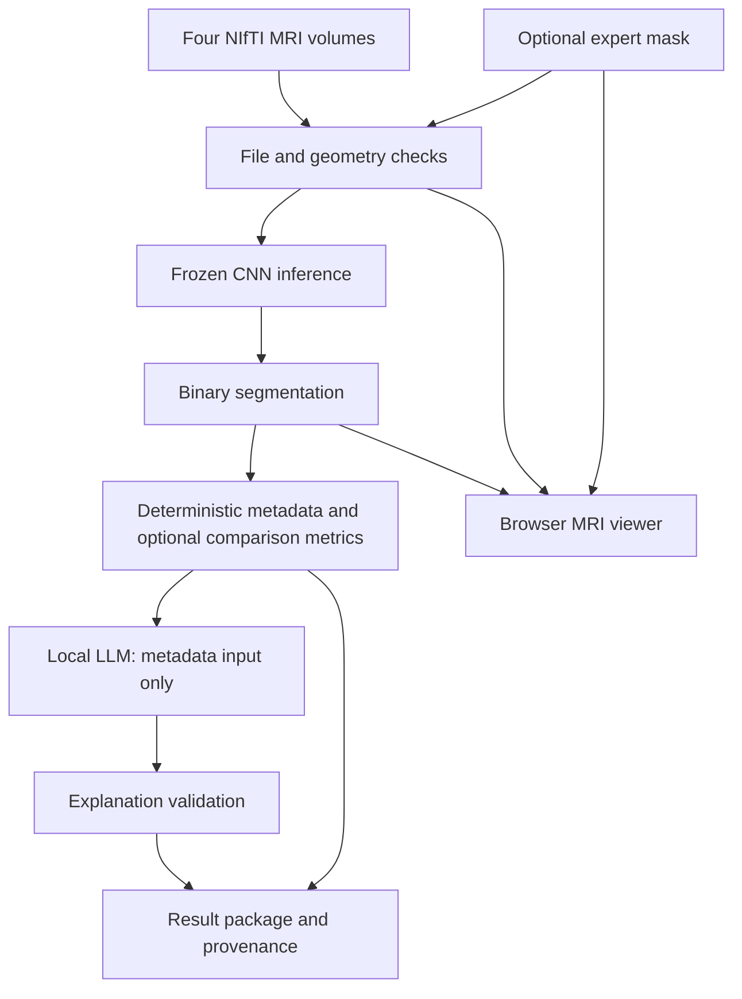
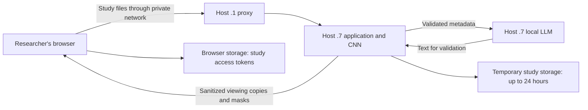

# A Local Brain MRI Segmentation Workspace with Reproducible Evidence and Constrained Language Explanation

Project synopsis · evidence reviewed September 4, 2026

## Abstract

This project implements a local research workspace that accepts four MRI
modalities, checks file and geometry compatibility, runs a frozen 3D segmentation
model, and displays its output on the scan. Researchers can compare a prediction
with an expert mask and download the segmentation, measured results, model
identity, and artifact hashes. A local language model converts validated metadata
into an explanation; scan pixels are outside its input contract. The recorded
60-case BraTS-SSA evaluation achieved mean whole-lesion Dice 0.8778 and median
Dice 0.9234. Six cases had Dice below 0.75, including one empty prediction. These
failures motivate visual inspection and further independent evaluation. The
contribution is an implemented, traceable research workflow. Its effect on user
comprehension and review efficiency remains a testable hypothesis.

## Problem and intended use

A researcher receiving a segmentation needs to inspect where it agrees or
disagrees with the image, determine which model produced it, and distinguish
measured evidence from explanation. This application brings those tasks into
one workflow for compatible four-modality research studies.

It supports model-output inspection, comparison with expert masks, failure
analysis, and reproducible demonstrations. Exported masks could be used as an
initial annotation in an external editor; correction tools and demonstrated
annotation-time savings are not current project results. The application does
not establish whether a person has a tumor or produce a clinical diagnosis.

## Prior work and contribution

Medical-image segmentation and viewing already have substantial tooling.
[3D Slicer](https://www.slicer.org/) provides visualization, segmentation, and
analysis; its [Segment Editor](https://slicer.readthedocs.io/en/5.8/user_guide/modules/segmenteditor.html)
supports mask editing. [Niivue](https://github.com/niivue/niivue) supplies browser
image rendering and is reused here. These capabilities must be credited when
describing the project; a viewer or CNN alone does not establish novelty.

The project contribution is the integration of input checks, fixed inference,
interactive inspection, optional reference comparison, expiring study access,
verifiable downloads, and metadata-constrained explanation. A controlled study
is needed to establish whether that integration improves research work compared
with a specified existing workflow. No superiority over Slicer has been tested.

## Research question and hypotheses

Can the workspace help a researcher inspect and reproduce a segmentation while
keeping language explanations faithful to the recorded evidence?

- H1: Compared with the same results supplied as files and a technical receipt,
  the workspace reduces time to locate model identity, inspect a discrepancy,
  and retrieve the correct output without reducing task accuracy.
- H2: Compared with deterministic text alone, the constrained LLM explanation
  improves understanding of measured results without adding unsupported claims.
- Engineering criterion: Every accepted result in the declared test set retains
  matching geometry and checkpoint provenance; specified invalid inputs are
  rejected. Passing these tests is bounded evidence, not a universal guarantee.

H1 and H2 are proposed experiments. They have not been established by the
existing model benchmark or automated application tests.

## Architecture

Local means user-controlled network hosts, not necessarily the browser's own
computer. Uploaded images reach `.7` through `.1`. Header text is removed from
viewing copies, but anatomical information remains sensitive. Hashes identify
artifacts; they do not prove that an image is anonymous, an expert mask is correct,
or a model is accurate. The [operating guide](prototype-operations.md) defines
retention and recovery behavior.

## Methods and reproducibility

The serving implementation uses a SegResNet-based network with four input
channels and one output channel. It normalizes nonzero voxels per modality and
uses sliding windows with a 0.5 probability threshold. All nonzero expert labels
are combined for whole-lesion scoring. Detailed parameters, limitations, and
source locations are in the [model card](research-model-card.md).

The frozen external plan names source `brats2023_ssa_hf`, source revision
`76608935145af0fb74a74b68f041471aa494f0f6`, 60 cases, and 10,000 bootstrap
replicates with seed 20260904. The recorded plan prohibits using this cohort for
training, threshold tuning, or checkpoint selection. Before making a stronger
independence claim, attach the patient-overlap audit and training manifest.
Source names and different filenames alone are insufficient.

Submission documentation must also attach original dataset citations, applicable
licenses/access terms, the actual training configuration and split hashes,
software versions, and contributor roles. These should be recovered from source
records rather than inferred from the inference code. See the model-card gaps.

## Recorded results

Values below come from the saved [public summary](../analyses/fixed-segresnet-external/summary.public.json).
They were not generated by a new evaluation during documentation.

| Measure | Recorded value | Scope |
| --- | --- | --- |
| Completed cases | 60/60 | Frozen BraTS-SSA benchmark |
| Mean Dice | 0.8778 | 60 cases, including empty output |
| Mean Dice bootstrap 95% interval | 0.8380–0.9088 | Case sampling within this cohort |
| Median Dice | 0.9234 | 60 cases |
| Mean IoU | 0.8023 | 60 cases |
| Mean precision / recall | 0.8868 / 0.8794 | Voxel-level comparison |
| Median HD95 | 4.4721 mm | 59 cases with defined boundary distances |
| Mean HD95 | 12.5899 mm | Same 59 cases |
| Empty prediction / unavailable HD95 | 1 / 1 | Report explicitly rather than omit |
| Dice below 0.75 | 6 cases | Post hoc descriptive subgroup |
| Mean / p95 case processing time | 4.1957 / 4.2906 seconds | Evaluator timing, not full app latency |

The evaluator timer includes validation/normalization, inference, and metrics.
Model loading occurs before that timer; uploads, explanation, ZIP creation, and
browser loading are outside it. Peak VRAM and full application latency require
a separately recorded benchmark.

The [failure analysis](../analyses/fixed-segresnet-external/failure-analysis.public.json)
groups the six weak cases as one empty output, two substantial oversegmentations,
and three other overlap/boundary errors. The handoff records a reproduced empty
prediction against a 1,026-voxel reference. Keep the corresponding private repeat
receipt with the research record before asserting reproducibility in a paper.

The [viewer acceptance record](../analyses/fixed-segresnet-external/viewer-acceptance.md)
documents application tests, protected downloads, desktop/mobile inspection, and
service restart restoration. Its repeat sample Dice of 0.9538 is an engineering
smoke result and does not increase the 60-case cohort size. Historical seed-arm
comparisons require their own configurations and reports; they are not repeated
external measurements of this checkpoint.

## Discussion and limitations

The gap between mean and median Dice, the empty prediction, and the HD95 tail
show why aggregate overlap alone is insufficient to assess outputs. The viewer
makes discrepancies inspectable, but qualified review has not yet established
clinical usefulness or measured annotation efficiency.

Geometry checks compare dimensions and affine metadata; they do not prove
anatomical registration or establish that a file labeled T1 really is T1.
The current reference flow requires a nonempty mask, so this benchmark does not
establish performance on tumor-negative studies. Whole-lesion scores also do not
measure separate tumor subregions. Language validation has tested constraints
but does not establish zero unsupported claims across arbitrary inputs.

Generalization to other sites and scanners, and user comprehension, remain open.
The bootstrap interval describes this cohort, not population or site shift.
Full-host reboot recovery was blocked by interactive authentication; service
restart recovery was tested. These are separate operational and scientific gaps.

## Next study and presentation

Use the [evaluation protocol](research-evaluation-protocol.md) to collect human
review, timing, and explanation evidence. It extends the existing
[independent-review worksheet](independent-validation-review.md).

For a synopsis presentation, use six slides: problem and user; architecture;
live viewer demonstration; frozen results and weak cases; tested engineering
properties; proposed experiments and remaining gaps. Include this synopsis,
the model card, frozen report, source/license records, and an experiment log
in the submission folder. Record personal, collaborator, AI-assisted, and
third-party contributions accurately. This is a general synopsis package;
no particular competition's current submission rules have been verified.

## Conclusion

The delivered system connects MRI input validation, segmentation, inspection,
provenance, and explanation in a usable local research workflow. Its documented
evaluation exposes both useful overlap and consequential failures. The next
contribution to establish is whether researchers complete defined review tasks
more accurately or efficiently using the workspace.
